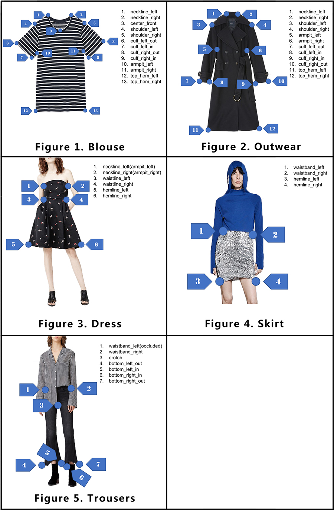
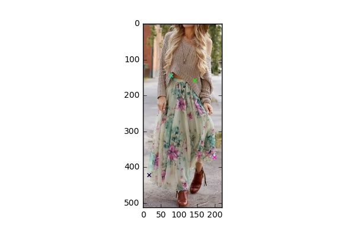
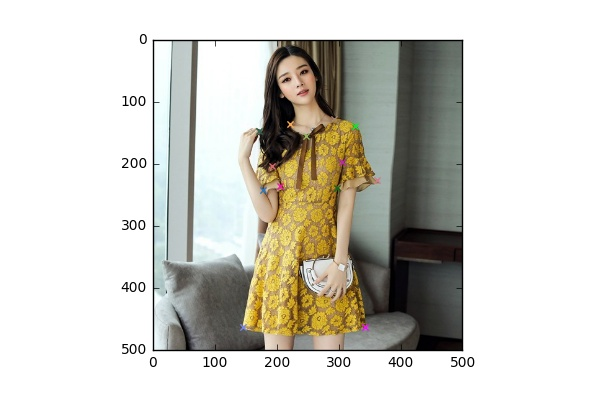

# FashionAI Global Challenge: Key points Detection of Apparel

- Introduction: [FashionAI Global Challenge](https://tianchi.aliyun.com/markets/tianchi/FashionAIeng?spm=a2c22.11190735.991137.10.329f6d83T8thsG&_lang=en_US)
- Description: [KeyPoints Detection of Apparel](https://tianchi.aliyun.com/competition/introduction.htm?spm=5176.100068.5678.1.4ccc289bCzDJXu&raceId=231648&_lang=en_US)
- [Leaderboard](https://tianchi.aliyun.com/competition/rankingList.htm?spm=5176.100067.5678.4.4a792743OjBoQ3&raceId=231648)
- Score of this code : 4.25%
- Team ranked 32/2322
- Mainly base on [Cascaded Pyramid Network for Multi-Person Pose Estimation](https://arxiv.org/abs/1711.07319).

## Image data
[Download](https://tianchi.aliyun.com/competition/information.htm?spm=5176.11409106.5678.2.572e2e48Nf8Kbu&raceId=231648)

## Folder Structure
- `nets`: store modified ResNet
- `model`: store checkpoint files
- `outputs` : store predicted files
- `summary`: store files for tensorboard
- `train_set`: place training data here
- `test_set`: place test data here
- `fashion_evaluator.py`: evaluator script
- `fashion_generator.py`: data generator
- `fashion_helper.py`: store a bunch of helper functions
- `fashion_stacked.py`: main file to define model
- `train_script.py`: train script
- `test_script.py`: test script

## Prerequisites
### Docker is recommended:
- nvidia-docker
- pull image from Docker Hub\
`docker pull yd8534976/tf-aiden`

### Alternatively:
- python
- tensorflow-gpu (>= 1.4)
- numpy
- pandas
- opencv-python
- jupyter (optional)
- tensorboard (optional)

### Pre-trained ResNet50 model
 - You can download pre-trained models from tensorflow offical
  [slim model zoo](https://github.com/tensorflow/models/tree/master/research/slim).
 - Put checkpoint files into `model/`

### Basic use
- Download datasets and put them into `train_set/`
- Download pre-trained ResNet-50 from slim model zoo
- Configure `train_script.py`
- Train end-to-end\
    `python train_script.py`
- Visualize your training using TensorBoard\
    `tensorboard --logdir=summary/`
- Generate predicted files\
    `python test_script.py`
- Visualize your prediction using `demo_notes.ipynb`
- Evaluate your predictions\
    `python fashion_evaluator.py`

### Demo
- blouse

- skirt

- outwear

- dress

- trousers

